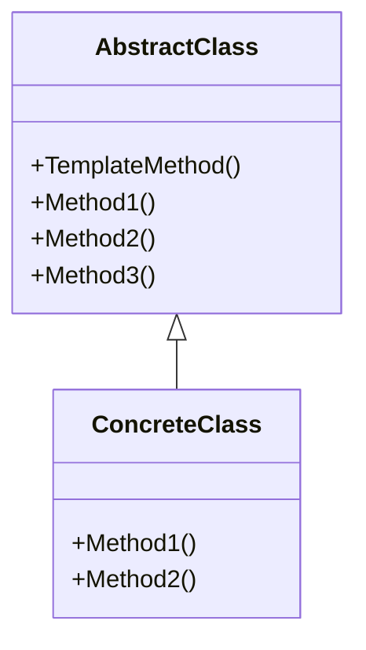
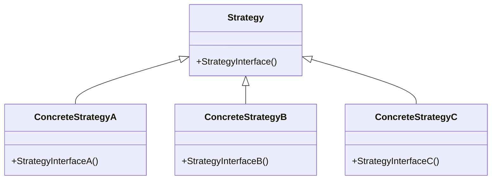

# design-patterns

## Principles

- Dependency inversion principle
- Openness closure principle
- Single responsibility principle
- Liskov substitution principle
- Interface isolation principle
- Give priority to using object composition rather than inheritance principle
- Encapsulating change points principle
- Program for interfaces rather than implementation programming principle

## Patterns

### Component collaboration

Template method

Strategy

Observer/Event

### Single responsibility

Decorator

Bridge

### Object creation

Factory method

Abstract factory

Prototype

Builder

### Object performance

Singleton

Flyweight

### Interface isolation

Facade

Proxy

Mediator

Adapter

### State change

Memento

State

### Data structure

Composite

Iterator

Chain of resposibility

### Behavioral change

Command

Visitor

### Domain issues

Interpreter

